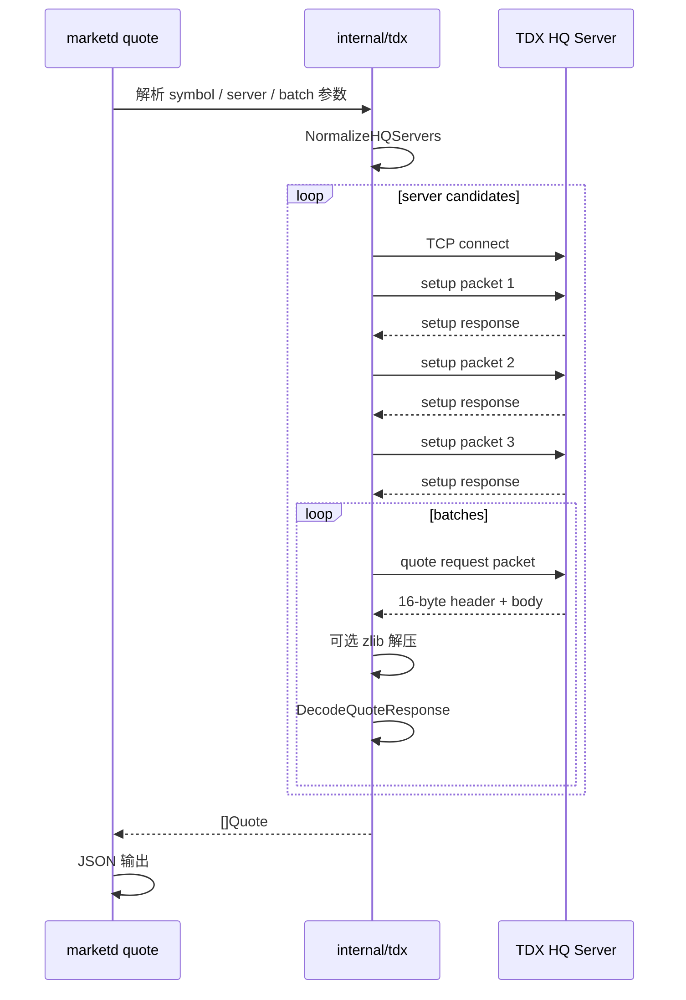

# TDX 实时行情实现说明

本文档说明 `marketd` 已实现的 TDX 标准行情和扩展行情能力，以及这些能力的实现原理。

相关代码：

- `internal/tdx/quote.go`：实时行情请求包、响应解析、价格和成交额解码。
- `internal/tdx/quote_ops.go`：server 探测、候选 server 重试、批量会话复用、证券列表、扫盘 workflow。
- `internal/tdx/exquote.go` / `internal/tdx/exquote_data.go`：`exhq` 扩展行情 market list、instrument catalog、quote、K 线、分时、分笔和历史接口请求/响应解析。
- `internal/cli/cli.go`：`quote`、`quote-probe`、`quote-sweep` 和 `exquote-*` CLI。

该实现用于平替 pytdx `hq.get_security_quotes` 和常用 `exhq` 读取接口，不依赖 Python、pytdx、mootdx、pandas，也不要求 ClickHouse 连接。

## HTTP API 边界设计

TDX 在线能力应作为 provider/protocol API 暴露，而不是混入 ClickHouse-backed 查询 API。

命名约定：

```text
/api/v1/...
  产品级查询 API，当前用于 ClickHouse-backed canonical market data。

/api/tdx/hq/...
  TDX 标准行情 provider API，使用 sh/sz/bj + 六位证券代码。

/api/tdx/exhq/...
  TDX 扩展行情 provider API，使用 numeric market id + instrument code。
```

这样拆分的原因：

- `/api/v1/bars` 查询的是已落库、可重复读取的事实数据。
- `/api/tdx/*` 发起 live TDX upstream 请求，可能受网络、server 可用性、协议限制、限流和超时影响。
- TDX `hq` 和 `exhq` 的市场命名、server pool、packet、字段含义不同，不应抽象成一个含糊的 realtime API。
- 后续控制台可以直接使用 `/api/tdx/*` 做 server 探测、quote smoke test、协议诊断，而不会污染产品查询 API。

首期 HTTP 形态保持 request/response：

```text
GET /api/tdx/hq/quotes
GET /api/tdx/hq/probe
GET /api/tdx/hq/securities
GET /api/tdx/hq/bars
GET /api/tdx/hq/minute
GET /api/tdx/hq/transactions

GET /api/tdx/exhq/markets
GET /api/tdx/exhq/instruments
GET /api/tdx/exhq/quote
GET /api/tdx/exhq/bars
GET /api/tdx/exhq/minute
GET /api/tdx/exhq/transactions
```

暂不做 WebSocket/SSE。TDX 标准行情公开协议本身更接近请求/响应轮询；如果以后需要推送，应在已有 request/response API 和连接生命周期策略稳定后单独设计。

`/api/tdx/*` 也不隐式写入 ClickHouse。实时快照持久化需要单独定义表结构、保留周期、去重策略和查询 contract。

## 已实现能力

### 单只或多只 A 股实时快照

命令：

```bash
go run ./cmd/marketd quote \
  --symbol sh:600519 \
  --symbol sz:000001 \
  --server 180.153.18.170:7709
```

支持：

- `sh` 上海市场。
- `sz` 深圳市场。
- 一个命令请求多只股票。
- `--symbol` 重复传入。
- `--symbol` 使用逗号分隔。
- 未显式 market 时按代码前缀推断。

symbol 示例：

| 输入 | 结果 |
| --- | --- |
| `sh:600519` | 上海 `600519` |
| `sz:000001` | 深圳 `000001` |
| `600519` | 推断为 `sh:600519` |
| `000001` | 推断为 `sz:000001` |

返回 JSON array。每条 quote 包含：

| 字段 | 含义 |
| --- | --- |
| `market` | `sh` 或 `sz` |
| `symbol` | 六位证券代码 |
| `price` | 当前价 |
| `last_close` | 昨收 |
| `open` / `high` / `low` | 当日开高低 |
| `server_time` | 兼容字段，TDX 返回的日内服务器时间 |
| `server_intraday_time` | 明确语义后的日内服务器时间 |
| `trade_date` | 调用方显式传入交易日时输出 |
| `quote_time` | `trade_date + server_intraday_time` |
| `volume` | 成交量字段 |
| `current_volume` | 现量字段 |
| `amount` | 成交额 |
| `sell_volume` / `buy_volume` | TDX payload 中的卖/买量字段 |
| `bids` | 五档买盘 |
| `asks` | 五档卖盘 |

示例：

```json
[
  {
    "market": "sh",
    "symbol": "600519",
    "price": 1272.86,
    "last_close": 1268,
    "open": 1278,
    "high": 1283,
    "low": 1267.74,
    "server_time": "14:52:22.494",
    "server_intraday_time": "14:52:22.494",
    "trade_date": "2026-06-05",
    "quote_time": "2026-06-05 14:52:22.494",
    "volume": 31303,
    "current_volume": 560,
    "amount": 3984001792,
    "sell_volume": 17408,
    "buy_volume": 13896,
    "bids": [
      { "price": 1271, "volume": 1 }
    ],
    "asks": [
      { "price": 1272.86, "volume": 7 }
    ]
  }
]
```

### 多 server 候选和自动重试

`quote` 支持多个 TDX HQ server：

```bash
go run ./cmd/marketd quote \
  --symbol sh:600519 \
  --server 119.147.212.81:7709 \
  --server 180.153.18.170:7709 \
  --server 60.191.117.167:7709
```

实现行为：

- 依次尝试候选 server。
- 连接失败、setup 失败、请求收发失败时切到下一个 server。
- 一旦某个 server 返回有效行情，停止访问后续候选。
- 解码错误不会被重试隐藏，直接返回错误，方便暴露协议解析问题。

默认候选 server 在 `tdx.DefaultHQServers` 中维护。当前默认 server 是：

```text
180.153.18.170:7709
```

### HQ server 探测

命令：

```bash
go run ./cmd/marketd quote-probe \
  --server 180.153.18.170:7709 \
  --server 60.191.117.167:7709
```

输出每个候选 server 的探测结果：

| 字段 | 含义 |
| --- | --- |
| `server` | server 地址 |
| `success` | 是否成功完成 TCP connect + TDX setup |
| `latency_ms` | 探测耗时 |
| `error` | 失败原因 |
| `preferred` | 最快可用 server |

探测结果会把成功 server 排在失败 server 前面，并标记最快成功 server 为 `preferred: true`。

### BestIP 缓存工作流

`quote-probe` 只做一次性探测。完整 bestip 工作流由 `quote-bestip` 提供：

```bash
go run ./cmd/marketd quote-bestip
go run ./cmd/marketd quote --symbol sh:600519 --bestip
go run ./cmd/marketd quote-bestip --watch --interval 30m
```

行为：

- `quote-bestip` 探测候选 TDX HQ server，按成功状态和延迟排序，并把结果写入本地 JSON cache。
- cache 默认路径是 `tdx.DefaultHQBestIPCachePath()`，可用 `--cache` 或消费命令的 `--bestip-cache` 覆盖。
- cache 记录 `generated_at`、`expires_at`、`preferred` 和完整探测结果；消费命令只使用成功 server，并保留延迟排序用于 fallback。
- `quote` / `quote-sweep` 在显式传入 `--bestip` 且没有 `--server` 时使用 cache；cache 缺失或过期时，默认会刷新一次。
- `--server` 永远优先于 bestip cache，方便操作员强制指定节点。
- `quote-bestip --watch --interval 30m` 可作为周期刷新进程运行；不需要 ClickHouse，也不写 market fact 表。

### 批量请求和连接复用

`quote` 和 `quote-sweep` 支持 `--batch-size`：

```bash
go run ./cmd/marketd quote \
  --symbol sh:600519,sz:000001 \
  --batch-size 80 \
  --server 180.153.18.170:7709
```

实现行为：

- 将请求 symbol 按 batch size 切分。
- 如果请求中包含 `bj`，当前会保守拆成单只请求；已验证 live `bj` 单只 quote 正常，live 多条 response 解析仍需单独完善。
- 每个 server candidate 打开一个 setup 完成后的 `QuoteSession`。
- 同一个 server 上的多个 batch 复用同一条 TCP 连接。
- 批量 workflow 结束后关闭连接。
- 当前没有全局长期连接池，避免 CLI 场景引入生命周期复杂度。

默认 batch size 是 `80`。

### 在线证券列表和扫盘 workflow

`quote-sweep` 支持显式 symbol list，也支持在线发现证券列表后扫盘。

显式 symbol list：

```bash
go run ./cmd/marketd quote-sweep \
  --symbol sh:600519,sz:000001 \
  --server 180.153.18.170:7709
```

在线发现市场证券并扫盘：

```bash
go run ./cmd/marketd quote-sweep \
  --market sh \
  --market sz \
  --limit 200 \
  --server 180.153.18.170:7709
```

实现能力：

- 请求 TDX 标准行情 server 的市场证券数量。
- 按 offset 请求市场证券列表。
- 解析 29 字节证券列表记录。
- 将发现到的 `sh` / `sz` 六位代码转换为 quote request。
- 使用批量 quote workflow 获取行情。
- `--limit` 可限制扫盘数量，方便 smoke test。

证券列表返回结构：

| 字段 | 含义 |
| --- | --- |
| `market` | `sh` 或 `sz` |
| `symbol` | 六位证券代码 |
| `name` | 证券名称，按 GB18030/GBK 解码；无法安全解码时为空 |
| `volunit` | TDX volume unit |
| `decimal_point` | 小数位 |
| `pre_close` | TDX 编码中的前收字段 |

### 扩展行情 `exhq`

`exhq` 是独立于标准 A 股 `hq` 的 TDX 扩展行情协议，常用于期货、期权、港股、外盘等扩展市场。它使用数字 market id 和 instrument code，不使用 `sh` / `sz` / `bj`。

查询扩展市场列表：

```bash
go run ./cmd/marketd exquote-markets \
  --server <exhq-server>
```

查询扩展品种数量和列表：

```bash
go run ./cmd/marketd exquote-count \
  --server 47.112.95.207:7720

go run ./cmd/marketd exquote-instruments \
  --start 0 \
  --count 100 \
  --server 47.112.95.207:7720
```

查询单个扩展品种 quote：

```bash
go run ./cmd/marketd exquote \
  --market 47 \
  --code TSL8 \
  --server 47.112.95.207:7720
```

查询 K 线、分时、分笔和历史接口：

```bash
go run ./cmd/marketd exquote-bars \
  --market 47 --code TSL8 --category 4 --start 0 --count 100 \
  --server 47.112.95.207:7720

go run ./cmd/marketd exquote-minute \
  --market 47 --code TSL8 \
  --server 47.112.95.207:7720

go run ./cmd/marketd exquote-history-minute \
  --market 47 --code TSL8 --date 20260605 \
  --server 47.112.95.207:7720

go run ./cmd/marketd exquote-transactions \
  --market 47 --code TSL8 --start 0 --count 1800 \
  --server 47.112.95.207:7720

go run ./cmd/marketd exquote-history-transactions \
  --market 47 --code TSL8 --date 20260605 --start 0 --count 1800 \
  --server 47.112.95.207:7720

go run ./cmd/marketd exquote-history-bars \
  --market 74 --code BABA --start-date 20260601 --end-date 20260605 \
  --server 47.112.95.207:7720
```

`exquote` 输出单个 JSON object，字段包括：

| 字段 | 含义 |
| --- | --- |
| `market` | TDX 扩展市场 ID |
| `code` | 扩展品种代码 |
| `pre_close` | 昨收 |
| `open` / `high` / `low` | 当日开高低 |
| `price` | 当前价 |
| `kaicang` | 开仓类字段 |
| `zongliang` | 总量 |
| `xianliang` | 现量 |
| `neipan` / `waipan` | 内盘 / 外盘 |
| `chicang` | 持仓类字段 |
| `bids` / `asks` | 五档买卖盘 |

其他 `exquote-*` 输出模型：

| 命令 | 输出 | 关键字段 |
| --- | --- | --- |
| `exquote-count` | JSON number | ExHQ server 返回的品种总数 |
| `exquote-instruments` | JSON array | `category`, `market`, `code`, `name`, `desc` |
| `exquote-bars` | JSON array | `datetime`, `open`, `high`, `low`, `close`, `position`, `trade`, `price`, `amount` |
| `exquote-minute` | JSON array | `time`, `price`, `avg_price`, `volume`, `open_interest` |
| `exquote-history-minute` | JSON array | `date`, `datetime`, `time`, `price`, `avg_price`, `volume`, `open_interest` |
| `exquote-transactions` | JSON array | `time`, `price`, `volume`, `zengcang`, `nature`, `nature_name`, `direction` |
| `exquote-history-transactions` | JSON array | `date`, `datetime`, `time`, `price`, `volume`, `zengcang`, `nature_name`, `direction` |
| `exquote-history-bars` | JSON array | `datetime`, `open`, `high`, `low`, `close`, `position`, `trade`, `settlement_price` |

`market` 和 `code` 会在所有按品种返回的结果中保留。ExHQ 文本字段按 GB18030/GBK fallback 解码；解码失败时只置空展示字段，不丢弃 `market` / `code`。

当前 `exhq` 已实现：

- market list；
- instrument count/list；
- single instrument quote；
- K 线；
- 分时；
- 分笔；
- 历史分时；
- 历史分笔；
- 历史 K 线范围；
- 多 server candidate 顺序 fallback；
- JSON CLI 输出。

当前 `exhq` 不实现：

- Level-2 认证行情；
- ClickHouse 持久化。

公共 ExHQ server 可用性不稳定。2026-06-07 实测：

| server | live 结果 |
| --- | --- |
| `47.112.95.207:7720` | TCP 可连；`instrument count` / `instrument list` 可返回；market list、quote/K 线/分时/分笔超时 |
| `47.102.108.214:7727` | TCP 可连；`instrument list` 可返回；quote/K 线/分时/分笔 reset |
| `112.74.214.43:7727` / `120.25.218.6:7727` / `116.205.143.214:7727` / `124.71.223.19:7727` | TCP 可连；可返回 `instrument count`；其他请求超时 |
| `61.152.107.141:7727` / `121.14.110.210:7727` | 当前网络下 TCP 超时 |

因此当前实现状态要区分两层：协议和 CLI 已实现；public server live 只验证到 catalog 能力。quote/K 线/分时/分笔需要交易日、券商账号线路或其他可用 ExHQ server 继续验证。

### 时间字段语义

TDX quote payload 只提供日内服务器时间，不提供完整日期。

因此当前输出：

- `server_time`：兼容字段。
- `server_intraday_time`：语义明确的日内时间。
- `trade_date`：只有传入 `--trade-date YYYY-MM-DD` 时输出。
- `quote_time`：只有传入 `--trade-date` 时输出。

示例：

```bash
go run ./cmd/marketd quote \
  --symbol sh:600519 \
  --trade-date 2026-06-05 \
  --server 180.153.18.170:7709
```

输出中会包含：

```json
{
  "server_intraday_time": "14:52:22.494",
  "trade_date": "2026-06-05",
  "quote_time": "2026-06-05 14:52:22.494"
}
```

### 明确不写 ClickHouse

实时行情命令当前只返回查询结果，不写入 ClickHouse。

原因：

- quote snapshot 属于高频数据，写入量和保留策略需要单独设计。
- 需要先定义表结构、逻辑键、分区、去重、保留周期。
- 不能把未定型的快照表混入当前 canonical OHLCV fact table。

如果未来决定持久化实时快照，应另起 OpenSpec change 定义 schema 和写入语义。

### `bj` 和 `exhq` 边界

当前标准行情实现支持 `sh` / `sz`，并支持已验证的 `bj` 单只 quote。

`bj`：

- 已验证 TDX 标准行情 quote market byte 为 `2`。
- `bj:920001`、`920001`、`920799` 在 `60.191.117.167:7709` 和 `180.153.18.170:7709` 上返回 `market=bj` 的标准 quote response。
- `920*`、`8*`、`4*` 会按本地市场推断映射到 `bj`；如果 server 返回不匹配的 fallback 代码，客户端会用 response identity 校验拒绝该结果。
- 证券数量/证券列表的 market byte `2` 在已探测 server 上未返回可用列表，因此 `quote-sweep --market bj` 仍不启用在线发现。

`exhq`：

- 当前已实现扩展市场列表、品种数量/列表、单合约 quote、K 线、分时、分笔和历史读取接口。
- 仍然独立于标准 A 股 `hq` client。
- 暂不支持 ExHQ ClickHouse 持久化和 Level-2 认证行情。
- 不应和标准 A 股 `hq` client 混在同一个协议路径里。

## 实现原理

### 总体流程



核心思想：

- CLI 只负责参数解析和 JSON 输出。
- TDX 协议细节集中在 `internal/tdx`。
- server retry 放在高层 workflow，不放在底层 decoder。
- decoder 只做协议解析，遇到截断、未知 market、格式错误直接报错。

### 请求参数解析

`ParseQuoteRequest` 把用户输入转换为：

```go
type QuoteRequest struct {
    Market string
    Symbol string
}
```

规则：

- `market:symbol` 显式指定市场。
- 无 market 时使用 `InferMarketFromCode`。
- 只允许 `sh` 和 `sz`。
- symbol 必须是六位数字。

TDX market byte：

| marketd | TDX market byte |
| --- | --- |
| `sz` | `0` |
| `sh` | `1` |

### 连接和 setup

`OpenQuoteSession` 完成：

1. TCP connect。
2. 设置 deadline。
3. 发送三个 TDX 标准行情 setup 包。
4. 返回可复用的 `QuoteSession`。

setup 包来自 pytdx 标准行情握手路径，对应：

- `SetupCmd1`
- `SetupCmd2`
- `SetupCmd3`

每次 setup 和请求都通过统一的 `quoteConn.call` 收发。

### Quote 请求包结构

`BuildQuoteRequestPacket` 构造 pytdx `hq.get_security_quotes` 等价请求。

对于 `N` 个 symbol：

```text
dataLen = N * 7 + 12
packetLen = 22 + N * 7
```

请求头：

| offset | size | value | 说明 |
| --- | ---: | --- | --- |
| `0` | 2 | `0x010c` | command prefix |
| `2` | 4 | `0x02006320` | command/magic |
| `6` | 2 | `dataLen` | payload length |
| `8` | 2 | `dataLen` | repeated payload length |
| `10` | 4 | `0x0005053e` | command parameter |
| `14` | 4 | `0` | reserved |
| `18` | 2 | `0` | reserved |
| `20` | 2 | `N` | symbol count |

每个证券条目 7 字节：

| size | 含义 |
| ---: | --- |
| 1 | TDX market byte |
| 6 | ASCII symbol |

示例：`sz:000001` + `sh:600519`

```text
00 30 30 30 30 30 31  01 36 30 30 35 31 39
```

### 响应封包和 zlib 解压

所有 TDX 请求都先读 16 字节响应头：

| header bytes | 含义 |
| --- | --- |
| `12..14` | compressed size |
| `14..16` | uncompressed size |

处理逻辑：

1. 读取 16 字节 header。
2. 按 compressed size 读取 body。
3. 如果 compressed size 等于 uncompressed size，body 不解压。
4. 如果两者不同，用 zlib 解压。
5. 解压后的 body 交给具体 decoder。

这部分由 `quoteConn.call` 实现。

### Quote 响应体结构

`DecodeQuoteResponse` 解析实时行情响应。

body 前缀：

| offset | size | 含义 |
| --- | ---: | --- |
| `0` | 2 | 忽略 |
| `2` | 2 | quote count |

每条 quote 开头：

| size | 含义 |
| ---: | --- |
| 1 | TDX market byte |
| 6 | symbol |
| 2 | `active1`，当前跳过 |

后续字段大多使用 TDX 变长有符号整数编码。

### TDX 变长有符号整数

`readTDXVarInt` 实现 TDX quote payload 中的变长整数。

第一个字节：

| bit | 含义 |
| --- | --- |
| `0..5` | value 低 6 位 |
| `6` | sign bit |
| `7` | continuation bit |

如果 continuation bit 为 1，后续字节每个贡献 7 位：

```text
value += (nextByte & 0x7f) << shift
shift 初始为 6，每读一个后续字节增加 7
```

如果 sign bit 为 1，最终值取负。

该编码用于：

- 当前价。
- 昨收、开、高、低相对当前价的差值。
- 五档买卖价相对当前价的差值。
- 成交量类字段。
- server time。
- 若干当前未暴露的协议字段。

### 价格解码

TDX A 股价格按整数分传输。

响应中 `price` 是当前价基准值，其他价格大多是相对当前价的 diff：

```text
decoded_price = (base_price + diff) / 100.0
```

字段映射：

| 输出字段 | 解码方式 |
| --- | --- |
| `price` | `base / 100.0` |
| `last_close` | `(base + lastCloseDiff) / 100.0` |
| `open` | `(base + openDiff) / 100.0` |
| `high` | `(base + highDiff) / 100.0` |
| `low` | `(base + lowDiff) / 100.0` |
| bid price | `(base + bidDiff) / 100.0` |
| ask price | `(base + askDiff) / 100.0` |

### 成交额解码

`amount` 不是普通 IEEE-754 float。

实现中先读取 4 字节 little-endian integer，再用 `decodeTDXFloat` 按 pytdx `get_volume` 的等价算法解码为 `float64`。

### server time 解码

TDX server time 也是变长整数。

`formatTDXQuoteTime` 按 pytdx 行为格式化：

```text
9300000 -> 9:30:00.000
```

注意：这个时间没有日期。只有当调用方显式传入 `--trade-date` 时，系统才输出完整 `quote_time`。

### HQ server 探测原理

`ProbeHQServers` 对每个候选 server 执行：

1. TCP connect。
2. 三个 setup 包。
3. 记录耗时。
4. 成功则标记 `success: true`。
5. 失败则记录错误文本。

`BestHQServer` 从成功结果中选择 `latency_ms` 最小的 server。

这不是长期健康检查，只代表探测时刻的可达性和响应速度。

### 自动重试原理

`FetchRealtimeQuoteBatches` 对候选 server 逐个尝试：

1. `OpenQuoteSession`。
2. 按 batch 发送 quote request。
3. 成功则返回结果。
4. 连接、setup、收发失败则尝试下一个 server。
5. decoder 错误直接返回，不继续重试。

这样做的原因是：

- 网络错误和 server 不可达可以通过切换 server 解决。
- decoder 错误通常说明协议结构不匹配，应该暴露给开发者。

### 批量连接复用原理

`SplitQuoteRequests` 把 symbol 切成多个 batch。

`QuoteSession` 在一个 server 上完成 setup 后，依次发送多个 batch 请求：

```text
connect + setup
  -> batch 1 quote request
  -> batch 2 quote request
  -> batch 3 quote request
close
```

这样避免每个 batch 都重复 TCP connect 和 setup。

### 在线证券列表原理

TDX 标准行情提供两个请求：

| 函数 | 作用 |
| --- | --- |
| `BuildSecurityCountPacket` | 获取市场证券数量 |
| `BuildSecurityListPacket` | 按 offset 获取证券列表页 |

证券数量响应：

```text
uint16 count
```

证券列表响应：

```text
uint16 item_count
item_count * 29-byte record
```

每条 29 字节记录当前解析：

| 字段 | 来源 |
| --- | --- |
| `symbol` | `record[0:6]` |
| `volunit` | `record[6:8]` |
| `name` | `record[8:16]`，固定 8 字节字段，先裁剪尾部 `\0` / 空格，再按 GB18030/GBK 解码 |
| `decimal_point` | `record[20]` |
| `pre_close` | `record[21:25]`，TDX float-like 解码 |

`QuoteSweep` 在未传入显式 symbol 时，会先调用证券列表发现，再进入批量 quote。

### ExHQ 实现原理

`OpenExQuoteSession` 完成：

1. TCP connect。
2. 设置 deadline。
3. 返回可复用的 `ExQuoteSession`。

pytdx 保留了一个 ExHQ setup 包，但 2026-06-07 实测多个当前可 TCP 连接的 public ExHQ server 对 setup 包不返回协议头，而能直接响应 instrument count 等业务包。因此当前 Go 实现默认不发送 setup 包。

扩展市场列表请求包：

```text
01 02 48 69 00 01 02 00 02 00 f4 23
```

扩展市场列表响应：

```text
uint16 count
count * 64-byte record
```

单合约 quote 请求包由固定 12 字节前缀加 10 字节 identity 组成：

```text
01 01 08 02 02 01 0c 00 0c 00 fa 23
uint8 market
char[9] code
```

单合约 quote 响应使用定长结构：

```text
uint8 market
char[9] code
byte[4] ignored
float32 pre_close, open, high, low, price
uint32 kaicang, ignored, zongliang, xianliang, ignored, neipan, waipan, ignored, chicang
float32 bid1..bid5
uint32 bid_vol1..bid_vol5
float32 ask1..ask5
uint32 ask_vol1..ask_vol5
```

`exhq` quote 价格字段是普通 `float32`，不同于标准 `hq` A 股 quote 的变长整数差分编码。

扩展品种数量请求：

```text
01 03 48 66 00 01 02 00 02 00 f0 23
```

扩展品种列表请求：

```text
01 04 48 67 00 01 08 00 08 00 f5 23
uint32 start
uint16 count
```

扩展品种列表响应：

```text
uint32 start
uint16 count
count * 64-byte record:
  uint8 category
  uint8 market
  byte[3] unused
  char[9] code
  char[17] name
  char[9] desc
  byte[24] reserved
```

扩展 K 线请求：

```text
01 01 08 6a 01 01 16 00 16 00 ff 23
uint8 market
char[9] code
uint16 category
uint16 unknown = 1
uint32 start
uint16 count
```

`category` 使用 TDX/pytdx 的数字周期：`0=5m`、`1=15m`、`2=30m`、`3=1h`、`4=day`、`5=week`、`6=month`、`7=ExHQ 1m`、`8=1m`、`9=day`、`10=quarter`、`11=year`。

扩展 K 线响应跳过前 18 字节后读取 `uint16 count`，每条记录包含 4 字节日期时间和 28 字节数据：

```text
datetime:
  category < 4 or category in (7, 8):
    uint16 packed_day
    uint16 packed_minute
  otherwise:
    uint32 yyyymmdd

data:
  float32 open, high, low, close
  uint32 position
  uint32 trade
  float32 price
```

分时请求：

```text
01 07 08 00 01 01 0c 00 0c 00 0b 24
uint8 market
char[9] code
```

历史分时请求：

```text
01 01 30 00 01 01 10 00 10 00 0c 24
uint32 date_yyyymmdd
uint8 market
char[9] code
```

分时响应记录：

```text
uint16 raw_time        # hour = raw_time / 60, minute = raw_time % 60
float32 price
float32 avg_price
uint32 volume
uint32 open_interest
```

分笔请求：

```text
01 01 08 00 03 01 12 00 12 00 fc 23
uint8 market
char[9] code
int32 start
uint16 count
```

历史分笔请求：

```text
01 01 30 00 02 01 16 00 16 00 06 24
uint32 date_yyyymmdd
uint8 market
char[9] code
int32 start
uint16 count
```

分笔响应记录：

```text
uint16 raw_time
uint32 price
uint32 volume
int32 zengcang
uint16 nature
```

`nature` 会拆成 `nature_mark`、`nature_value`、`nature_name` 和 `direction`。港股类市场 `31` / `48` 按 pytdx 兼容逻辑将 `nature=0/256` 映射为 `B` / `S`。

历史 K 线范围请求：

```text
01 01 38 92 00 01 16 00 16 00 0d 24
uint8 market
char[9] code
uint16 category = 7
uint32 start_date_yyyymmdd
uint32 end_date_yyyymmdd
```

历史 K 线范围响应记录为 32 字节：

```text
uint16 packed_day
uint16 packed_minute
float32 open, high, low, close
uint32 position
uint32 trade
float32 settlement_price
```

这些命令只读取并输出 JSON，不做落库。

### CLI 错误处理

参数错误返回 exit code `2`：

- 没有 `--symbol`。
- symbol 格式错误。
- market 不支持。
- flag 解析失败。

运行时错误返回 exit code `1`：

- 所有 server candidates 都失败。
- TCP connect 超时。
- 请求收发失败。
- 响应截断。
- zlib 解压失败。
- 响应中出现不支持的 TDX market code。

stdout 只输出 JSON，stderr 输出错误。

## 测试和验证

单元测试：

```bash
go test ./internal/tdx ./internal/cli
```

全量测试：

```bash
go test ./...
```

OpenSpec 校验：

```bash
openspec validate --all
```

实时 smoke test：

```bash
go run ./cmd/marketd quote \
  --symbol sh:600519 \
  --symbol sz:000001 \
  --server 180.153.18.170:7709
```

server 探测：

```bash
go run ./cmd/marketd quote-probe \
  --server 180.153.18.170:7709 \
  --server 60.191.117.167:7709
```

小规模扫盘：

```bash
go run ./cmd/marketd quote-sweep \
  --market sh \
  --limit 10 \
  --server 180.153.18.170:7709
```

扩展市场列表：

```bash
go run ./cmd/marketd exquote-markets \
  --server <exhq-server>
```

扩展品种列表：

```bash
go run ./cmd/marketd exquote-count \
  --server 47.112.95.207:7720

go run ./cmd/marketd exquote-instruments \
  --start 0 \
  --count 20 \
  --server 47.112.95.207:7720
```

扩展品种 quote：

```bash
go run ./cmd/marketd exquote \
  --market 47 \
  --code TSL8 \
  --server 47.112.95.207:7720
```

扩展 K 线 / 分时 / 分笔：

```bash
go run ./cmd/marketd exquote-bars \
  --market 47 --code TSL8 --category 4 --start 0 --count 100 \
  --server 47.112.95.207:7720

go run ./cmd/marketd exquote-minute \
  --market 47 --code TSL8 \
  --server 47.112.95.207:7720

go run ./cmd/marketd exquote-history-minute \
  --market 47 --code TSL8 --date 20260605 \
  --server 47.112.95.207:7720

go run ./cmd/marketd exquote-transactions \
  --market 47 --code TSL8 --start 0 --count 1800 \
  --server 47.112.95.207:7720

go run ./cmd/marketd exquote-history-transactions \
  --market 47 --code TSL8 --date 20260605 --start 0 --count 1800 \
  --server 47.112.95.207:7720

go run ./cmd/marketd exquote-history-bars \
  --market 74 --code BABA --start-date 20260601 --end-date 20260605 \
  --server 47.112.95.207:7720
```

北交所实时行情：

```bash
go run ./cmd/marketd quote --symbol bj:920001
```

显式北交所 symbol list 也可走 `quote-sweep`，但当前会拆成单只请求：

```bash
go run ./cmd/marketd quote-sweep \
  --symbol 920001,bj:920799 \
  --server 60.191.117.167:7709
```

## 长期运行的实时行情服务 (`quote-serve` / `quote-status`)

在一次性 `quote` / `quote-sweep` 命令之上，`internal/quotesvc` 提供长期运行的全市场扫盘服务。协议构造和解码仍然只在 `internal/tdx`；`quotesvc` 只负责生命周期和策略，不直接打开 ClickHouse。

### 运行方式

- `marketd quote-serve`：规划并执行一次扫盘。
  - `--symbol` 显式指定标的（重复或逗号分隔）；不给则按市场在线发现证券列表。
  - `--market` 发现市场（默认取配置 `quote_service.markets`，即 `sh,sz`）。
  - `--limit` 限制本次扫盘标的数。
  - `--resume <run_id>` 从 `infinity_ops` 中的持久批次状态恢复，只重跑未成功的批次。
  - 收到 `SIGINT`/`SIGTERM` 时优雅停机：停止派发新批次（drain），在 `shutdown_deadline` 内让在飞批次完成，超时再硬取消；最终 run/batch 状态都会落库。
- `marketd quote-status`：读取 `infinity_ops` 中的 run/batch 记录（经共享 `Store`，**不经 infinity querier**），列出最近的 run 或用 `--run <run_id>` 看单次 run 的批次明细，`--json` 输出 JSON。

### 连接生命周期

每个 server 维护一个有界连接池（`max_conns_per_server`）：复用空闲连接、复用一次 setup 握手；空闲超过 `heartbeat_interval` 的连接在复用前做一次轻量心跳（重发首个 setup 包），心跳失败则关闭重连并计数；空闲超过 `idle_timeout` 或存活超过 `max_conn_age` 的连接退休重连。

### 扫盘、限流和失败恢复

- 标的来源为显式列表或在线证券发现，按 `batch_size` 切成带稳定编号的批次。
- 批次以 `batch_concurrency` 并发执行，受全局和单 server 令牌桶限流（`global_rate_per_sec` / `per_server_rate_per_sec` / `burst`）。
- 失败分类为 transport / timeout / server_select / rate_limit / decode；可恢复失败按 `retry_budget` + 指数退避（带抖动，`backoff_base`/`backoff_max`）重试，并可跨 server 回退；**decode（解析）失败不重试，原样保留**，避免掩盖解析回归。
- 单个批次重试耗尽后标记失败，扫盘继续处理其他批次（失败隔离）。
- run/batch 进度写入 `infinity_ops.quote_service_runs` / `quote_service_batches`（`ReplacingMergeTree(updated_at)`），resume 基于这些持久状态而非 quote 输出。

### 默认值（保守，面向公共 TDX 服务器）

| 配置 | 默认 |
|---|---|
| `batch_size` | 80 |
| `max_conns_per_server` | 2 |
| `batch_concurrency` | 2 |
| `heartbeat_interval` | 30s |
| `idle_timeout` | 60s |
| `max_conn_age` | 5m |
| `dial_timeout` | 5s |
| `global_rate_per_sec` | 5 |
| `per_server_rate_per_sec` | 3 |
| `burst` | 5 |
| `retry_budget` | 2 |
| `backoff_base` / `backoff_max` | 500ms / 5s |
| `shutdown_deadline` | 10s |

### 已知限制

- 只覆盖标准行情 `sh`/`sz` 路径；`bj` 和 `exhq` 仍归各自的 change，不在本服务范围内。
- 不持久化 quote snapshot：服务只写 ops-plane 的 run/batch 记录，绝不向 canonical 行情 fact 表写实时快照（编译期由 `var _ quotesvc.StateStore = (*clickhouse.Store)(nil)` 保证 StateStore 只暴露 ops 写入）。
- resume 是 at-least-once：若在 fetch 成功后、状态落库前失败，可能重复抓取一次该批次。当前可接受，因为快照不落库；若将来接受快照存储契约，需重新审视 resume 幂等性。
- 状态读取走 marketd 自身的 `Store`（与 `marketd status` 一致），不引入 infinity querier、新 binary 或独立 ops 服务。

## 当前限制

- `bj` 实时行情支持已验证的 `920*` quote；旧 `8*` / `4*` 代码会按 `bj` 请求，但实际可用性取决于 server 是否仍提供该代码，返回不匹配时会报 identity mismatch。
- `bj` 证券数量/证券列表尚未可用，`quote-sweep --market bj` 仍会返回 unsupported security-list market。
- 含 `bj` 的 quote request 当前强制单只分包；live 多条 response 解析需要单独完善后再放开批量。
- `exhq` public server 可用性不稳定；metadata 可用不代表 quote/K 线/分时/分笔也可用。
- `exhq` 文本字段已按 GB18030/GBK fallback 解码；解码失败时置空展示字段，不丢弃 market/code。
- 长期心跳保活和连接池已由 `quote-serve` / `internal/quotesvc` 提供；一次性 `quote` / `quote-sweep` 命令仍是无池的短连接。
- 不做实时流式订阅。
- 不写 ClickHouse 行情 fact 表（实时快照不落库；`quote-serve` 的 ops-plane run/batch 记录除外）。
- 标准 `hq` 证券列表名称已按 GB18030/GBK 解码；解码失败时只置空 `name`，不丢弃代码。
- `quote_time` 只有调用方显式提供 `--trade-date` 时才输出。

## 后续方向

- 继续验证 `bj` 证券列表 discovery，以及 live 多条 quote response 的完整 parser 边界。
- 给 `exhq` 增加专门的 server probe 命令，区分 count/list/quote/K 线等能力。
- ~~如果需要长期运行的行情服务，再引入连接池、心跳和定期重连。~~ 已由 `quote-serve` / `internal/quotesvc` 实现（见上节）。
- 如果需要持久化 quote snapshot，另起 OpenSpec change 定义 ClickHouse schema、保留策略和去重语义。
